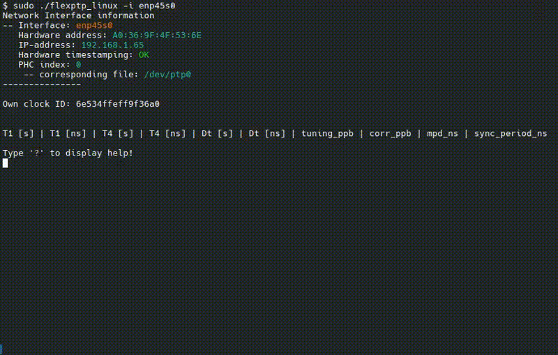

# flexPTP Linux demo



## What's this?

> **This is a [flexPTP](https://github.com/epagris/flexPTP) demo project showcasing the capabilities of the flexPTP [IEEE 1588 Precision Time Protocol](https://ieeexplore.ieee.org/document/9120376) implementation on Linux systems.**

Still not clear what is it useful for? No worries, it's a behind-the-scenes support technology that you use unaware every day if you have a smartphone or when you are connected to the internet. Modern telecommunication and measurement systems often rely on precise time synchronization down to the nanoseconds' scale. Methods got standardized by the IEEE and now it's known by the name of the Precision Time Protocol. This software project is an evaluation environment to showcase the capabilities of our IEEE 1588 PTP implementation named `flexPTP` on Linux systems.

> [!NOTE]
> The primary goal of the flexPTP library is supporting microcontrollers. This project and the Linux port is an exceptional, experimental project for the time being. This project has been inspired by the [linuxptp](https://github.com/richardcochran/linuxptp) application. Want to learn more about the implementation? Head to [Under the hood...](#under-the-hood)!

### Get the sources

> [!NOTE]
> To acquire the full source tree after cloning the repo, please fetch the linked *submodules* as well:

```
git clone https://github.com/epagris/flexPTP-demo-linux/
cd flexPTP-demo-linux
git submodule init
git submodule update
```

## Building

### Prerequisites

The following two pieces of software are necessary for building:
- `gcc` (v12+): the GCC C
- `cmake` (v3.22+): KitWare's build management system

### Compiling

The project is fully CMake managed. Configure and invoke the cross-compiler using the commands below:

```
cmake . -B build
cmake --build build --target flexptp_linux --
```
Once the building has concluded the output binary will be deposited in the `build` directory: `flexptp_linux`.

## Running

Start the `flexptp_linux` application with superuser right so it can execute privileged socket- and PHC-related commands. Pass the targeted network interface using the `-i` parameter, e.g. `sudo flexptp_linux -i eth0`
Connect your device to any PTP-compliant equipment (e.g. another Linux-based machine or embedded system with [flexPTP](https://github.com/epagris/flexPTP) or [linuxptp](https://github.com/richardcochran/linuxptp)) to test the flexPTP library. The application has an all-around CLI implemented. Startup configuration can be passed using the `-c` parameter (e.g. `sudo flexptp_linux -i eth0 -c flexptp_startup.cfg`) which should contain one command per line (like typing commands on the CLI).

The flexPTP parameters are defined in the [flexptp_options.h](Inc/flexptp_options.h) header.

### CLI commands

The software offers you with the following multitude, most flexPTP-related of commands:

```
?                                                  Print this help
ptp reset                                          Reset PTP subsystem
ptp servo offset [offset_ns]                       Set or query clock offset
ptp log {def|corr|ts|info|locked|bmca} {on|off}    Turn on or off logging
time [ns]                                          Print time
ptp master [[un]prefer] [clockid]                  Master clock settings
ptp info                                           Print PTP info
ptp domain [domain]                                Print or get PTP domain
ptp addend [addend]                                Print or set addend
ptp transport [{ipv4|802.3}]                       Set or get PTP transport layer
ptp delmech [{e2e|p2p}]                            Set or get PTP delay mechanism
ptp transpec [{def|gPTP}]                          Set or get PTP transportSpecific field (majorSdoId)
ptp profile [preset [<name>]]                      Print or set PTP profile, or list available presets
ptp tlv [preset [name]|unload]                     Print or set TLV-chain, or list available TLV presets
ptp pflags [<flags>]                               Print or set profile flags
ptp period <delreq|sync|ann> [<lp>|matched]        Print or set log. periods
ptp coarse [threshold]                             Print or set coarse correction threshold
ptp priority [<p1> <p2>]                           Print or set clock priority fields
```

> [!TIP]
> The above hint can be listed by typing '?'.

## Under the hood

The porting layer used in this project is very much different compared to a conventional port supporting a specific  microcontroller. The [Network Stack Driver](https://epagris.github.io/flexPTP/porting.html#network-stack-driver) and the Hardware Port got unified into the single [nsd_linux.c](https://github.com/epagris/flexPTP/blob/master/src/flexptp/port/example_netstack_drivers/nsd_linux.c) source file. The port uses the Linux kernel's built-in PHC-adjustment functions and standard POSIX socket operations. Each major step is documented in the NSD source file.


## Related papers and references

[Time Synchronization Extension for the IO-Link Industrial Communication Protocol](https://ieeexplore.ieee.org/document/10747727)

[Distributed Measurement System for Performance Evaluation of Embedded Clock Synchronization Solutions](https://ieeexplore.ieee.org/document/9805958/)

[Portable, PTP-based Clock Synchronization Implementation for Microcontroller-based Systems and its Performance Evaluation](https://ieeexplore.ieee.org/document/9615250)

[Synchronization of Sampling in a Distributed Audio Frequency Range Data Acquisition System Utilizing Microcontrollers](https://ieeexplore.ieee.org/document/9918455/)

[Methods of Peripheral Synchronization in Real-Time Cyber-Physical Systems](https://ieeexplore.ieee.org/document/10178979/)


## License

The project was created by András Wiesner (Epagris) in 2025 and published under the MIT license. Contributions are welcome! :)


